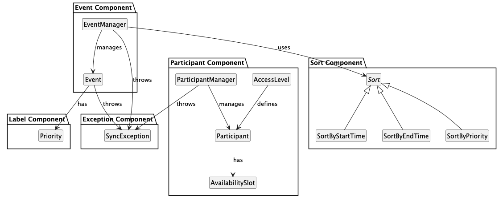
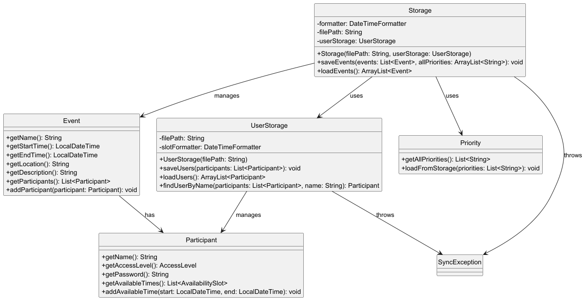
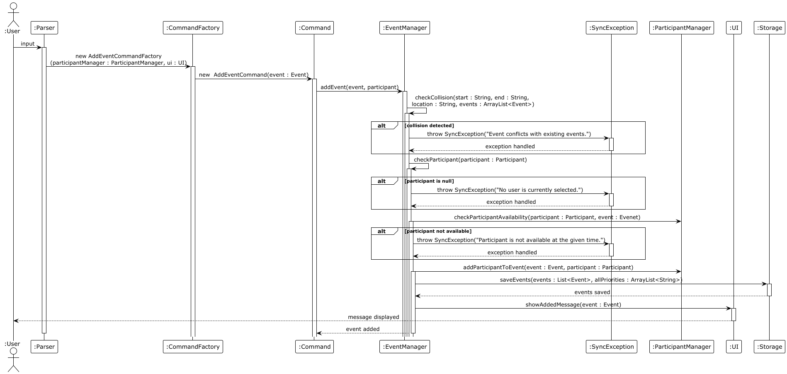
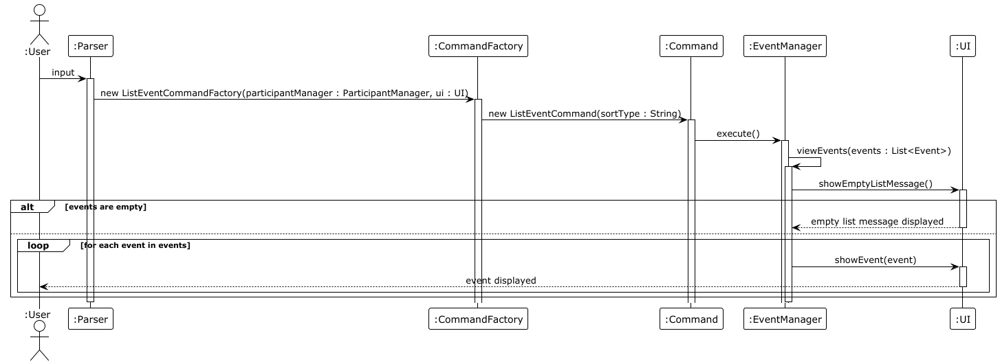
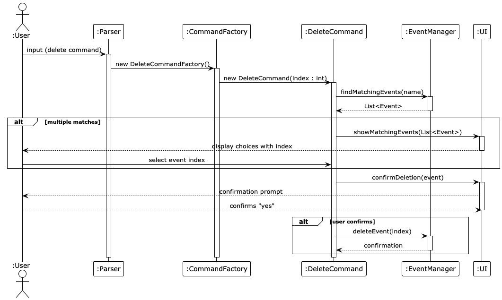
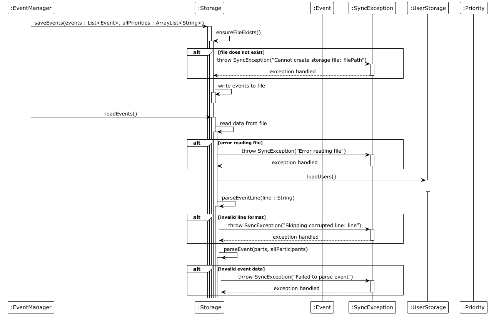
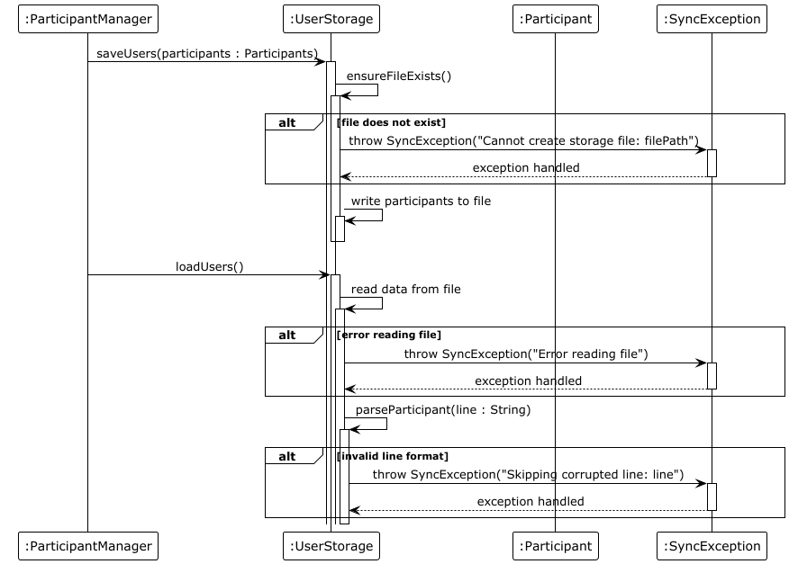
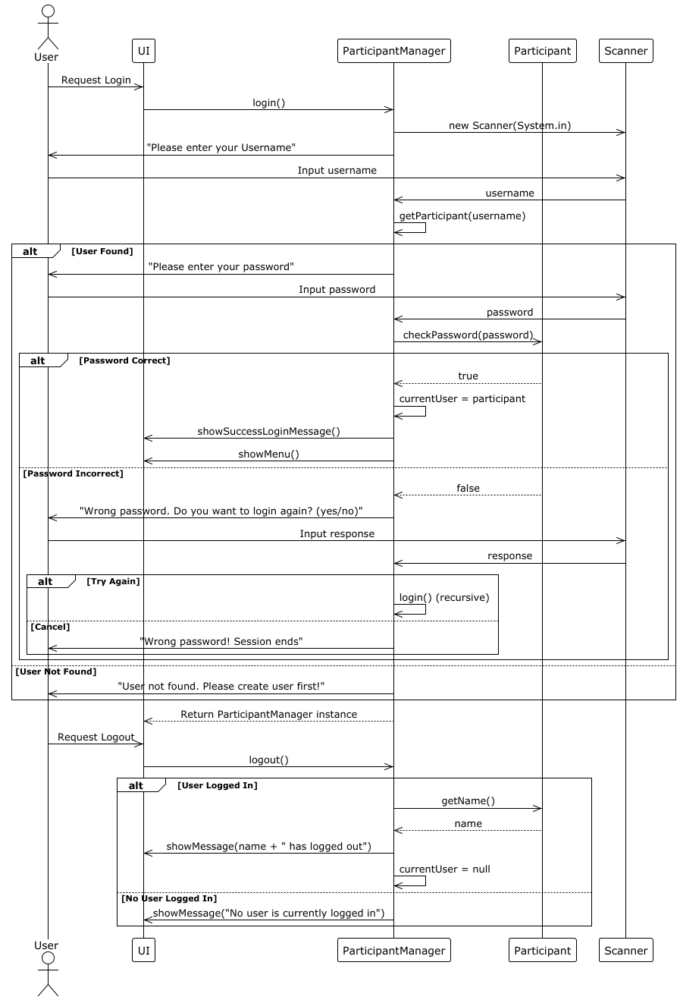
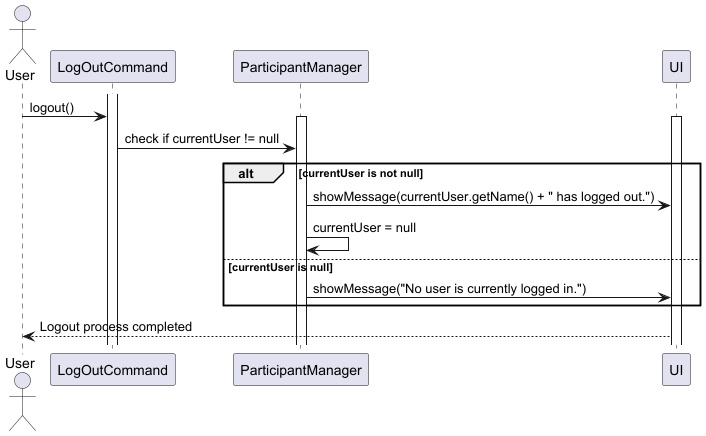
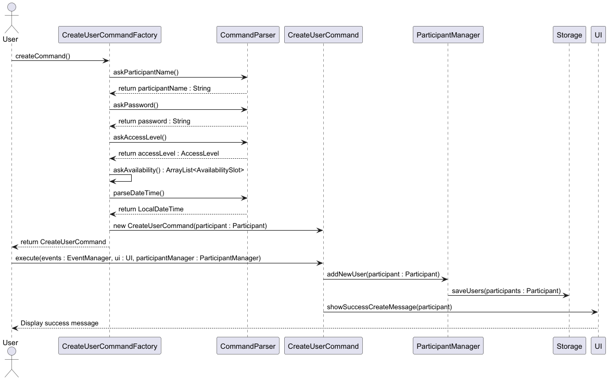

# Event Manager Developer Guide

# Event Manager Developer Guide

## Table of Contents
1. [Acknowledgements](#acknowledgements)
2. [Introduction](#introduction)
3. [Setting Up](#setting-up-the-development-environment)
4. [Component Overview](#component-overview)
  - 4.1 [Main Component](#1-main-component-eventsyncjava)
  - 4.2 [UI Component](#2-ui-component-uijava)
  - 4.3 [Logic Component](#3-logic-component)
  - 4.4 [Model Component](#4-model-component)
  - 4.5 [Storage Component](#5-storage-component)
  - 4.6 [Logger Component](#6-logger-component)
  - 4.7 [Common Classes](#7-common-classes)
5. [Design & Implementation](#design--implementation)
  - 5.1 [Add Event](#1-add-event-feature)
  - 5.2 [Edit Event](#2-edit-event-feature)
  - 5.3 [Conflict Detector](#3-conflict-detector-feature)
  - 5.4 [List Events](#4-list-event-feature)
  - 5.5 [Delete Event](#5-delete-event-feature)
  - 5.6 [Priority Filter](#6-priority-filter-feature)
  - 5.7 [Duplicate Event](#7-duplicate-event-feature)
  - 5.8 [Add Participant](#8-add-participant-feature)
  - 5.9 [List Participants](#9-list-participants-feature)
  - 5.10 [Event Storage](#10-event-storage-feature)
  - 5.11 [User Storage](#11-user-storage-feature)
  - 5.12 [Login System](#12-login-system-feature)
6. [Documentation & DevOps](#documentation-logging-testing-configuration-dev-ops)
7. [Appendix](#appendix)
  - 7.1 [Product Scope](#product-scope)
  - 7.2 [User Stories](#user-stories)
  - 7.3 [Non-Functional Requirements](#non-functional-requirements)
  - 7.4 [Glossary](#glossary)
  - 7.5 [Manual Testing](#instructions-for-manual-testing)

[Continue with your existing content...]
## Acknowledgements

### Project Framework
- **[CS2113 Individual Project Template](https://github.com/nus-cs2113-AY2425S2/ip)**  
  Used as the foundational project structure with modifications for our event management system

### Tutorial Resources
- **[SE-EDU PlantUML Guide](https://se-education.org/guides/tutorials/plantUml.html)**  
  Referenced for creating all UML diagrams in this project

## Introduction

This project is a CLI-based Event Manager designed to help users organize their schedules effectively. In addition to 
creating, editing, deleting, and sorting events, the application supports participant management with access levels and 
availability. This Developer Guide documents the architecture, features, design considerations, and implementation 
details to help contributors understand the codebase and make meaningful contributions.

## Setting Up the Development Environment

### Prerequisites

- `JDK 17`
- `Gradle 7.6.2` or higher
- `IntelliJ IDEA` (recommended IDE for Java development)

### Getting Started

#### 1. Clone the Repository

Clone the repository to your local machine:
```
git clone https://github.com/AY2425S2-CS2113-W13-2/tp.git
```
#### 2. Import the Project into IntelliJ IDEA

To import the project:

- Open `IntelliJ IDEA`
- Click on `File → Open`
- Select the `tp` directory
- Choose the `build.gradle` file and open it
- Select `Open as Project` when prompted
- Ensure the JDK is set to `JDK 17`
- Wait for Gradle to finish syncing

#### 3. Verify the Setup

To ensure everything is working correctly, you can:

- Run all tests:
```
  ./gradlew test
```
- Launch the application:
```
./gradlew run
```
---

## Component Overview

[Click here to view the UML class diagram](UMLClassDiagram.pdf)

The architecture of Event Manager is structured into clearly defined components to ensure modularity and 
maintainability. The core components are outlined below:

### 1. Main Component (EventSync.java)


- The **Architecture Diagram** given above explains the high-level design of the App.

- Given below is a quick overview of main components and how they interact with each other.

- **Main components of the architecture**

- **Main**(`EventSync.java`) is in charge of the initialization and execution of the system. 
  - At launch, it initializes the other components in the correct sequence, and connects them up with each other.
  - At shut down, it shuts down the other components and invokes cleanup methods where necessary.

- The bulk of the system’s work is done by the following components:
  - **UI**: The user interface that interacts with the user.
  - **Logic**: The command executor responsible for processing commands. 
  - **Model**: Maintains the application's data in memory, including participants and events.
  - **Storage**: Reads data from, and writes data to, files for persistence.

- **Logger** handles logging of system events, errors, and debugging information.
- **Commons**: Provides shared utilities and helper functions used across components.

- **How the architecture components interact with each other**
- Each of the main components:
  - Defines its API in an interface with the same name as the component.
  - Implements its functionality using a concrete {Component Name}Factory class, which follows the corresponding API interface.

- The sections below give more details of each component.
---


### 2. UI Component (UI.java)
- Handles all user interaction through the command line.
- Displays menus, messages, prompts, and results.
- Reads user input and forwards it to the Parser.
---

### 3. Logic Component
- **Parser Component**:
  - Parser.java: Main parsing interface
  - CommandParser.java: Specialized parser for command inputs
- **Command Component**: Implements Command pattern with classes like:
  - Command.java: Abstract base class for all commands
  - AddEventCommand.java: Handles event creation
  - EditEventCommand.java: Allows event modification
  - DeleteCommand.java: Removes events
  - DuplicateCommand.java: Creates copies of events
  - ListCommand.java: Shows events with sort options
  - ListAllCommand.java: Displays all events
  - ListParticipantsCommand.java: Shows event participants
  - FindCommand.java: Searches for specific events
  - FilterCommand.java: Filters events by criteria
  - LoginCommand.java: Handles user authentication
  - LogOutCommand.java: Manages user logout
  - ByeCommand.java: Exits the application
  - CreateUserCommand.java: Creates new user profiles
  - AddParticipantCommand.java: Adds users to events
- **CommandFactory Component**: Factory pattern implementation for command creation:
  - CommandFactory.java: Base factory interface
  - Specialized factories for each command type (e.g., AddEventCommandFactory, DeleteCommandFactory)

---

### 4. Model Component

The **Model Component** is responsible for representing the core data entities of the system and providing functionality to manage them. It is composed of the following parts:

- **Event Component**:
  - `Event.java`: Core data structure for scheduled activities.
  - `EventManager.java`: Manages the event collection and operations such as add, delete, or retrieve.

- **Participant Component**:
  - `Participant.java`: Represents users in the system.
  - `ParticipantManager.java`: Manages users including creation, deletion, and authentication.
  - `AvailabilitySlot.java`: Tracks availability timeslots for participants.

- **Label Component**:
  - `Priority.java`: Enum-like structure for event priority levels, supports flexible priority assignment.

- **Sort Component** (implements Strategy Pattern):
  - `Sort.java`: Abstract base class defining the sorting interface.
  - `SortByStartTime.java`, `SortByEndTime.java`, `SortByPriority.java`: Concrete implementations for sorting logic.

- **Exception Component**:
  - `SyncException.java`: Custom exception used for synchronization-related errors within model operations.

### 5. Storage Component
- Storage.java: Base class for data persistence
- UserStorage.java: Handles user data storage
- Uses file I/O to save and load events and user data



#### API: UserStorage.java

The `UserStorage` component,

- is responsible for saving and loading user-related data, including participant details.
- stores data in a structured format, ensuring persistence across sessions. (sample: Alice | MEMBER | 123 | 2025-03-31 12:00,2025-05-31 12:00)
- depends on `Participant` as it manages participant-related storage operations.
- throws `SyncException` in case of synchronization failures.

#### API: Storage.java

The `Storage` component,

- handles the storage and retrieval of both event and priority data.
- integrates `UserStorage` to manage participant-related information.
- can save and load events, including participant details and scheduling information.
- depends on `UserStorage`, `Event`, and `Priority` as it manages multiple data types.
- throws `SyncException` to handle potential storage errors.
---

### 6. Logger Component
- EventSyncLogger.java: Handles logging for debugging and tracking

---

### 7. Common classes
- Classes used by multiple components are in the src/main/java package.

---

## Design & Implementation

### 1. Add Event Feature

### Implementation
The `AddEventCommand` feature allows users to add an event to their schedule. It is implemented using the `Command` pattern, where `AddEventCommand` extends `Command`.

1. **Step 1. CLI Input (`add` Command)**:
- The user inputs the `add` command via the CLI. This command is parsed, and the `Parser` creates an `AddEventCommandFactory` object.

2. **Step 2. Event Information Collection**:
- The system prompts the user to input details of the event (such as time, location, and participant).

3. **Step 3. Command Object Creation**:
- The `AddEventCommand` object is created with the collected event information.

4. **Step 4.Executing `addEvent`**:
- The `addEvent` method of `EventManager` is called to add the event to the system.
- This involves collision checks, participant availability checks, and priority assignment.
- The event is successfully added to the system and saved to storage.


### Expanded Flow of `addEvent` Method Execution

**Step 1. Null Check for Event**
- The system ensures that the `event` is not null. If it is, an `AssertionError` is thrown.

**Step 2. Collision Check**
- The `checkCollision` method is invoked to ensure that the event does not overlap with any existing events based on the start and end time, as well as the location.
- If a conflict is found, a `SyncException` is thrown with an appropriate message, indicating the overlap.

**Step 3. Participant Availability Check**
- **If the `participant` is null**: A `SyncException` is thrown indicating that a participant must be specified for the event.
- **Check Availability**: Ensures that the `participant` is available during the event's scheduled time. If not, a `SyncException` is thrown, informing that the participant is unavailable.

**Step 4. Add Participant to Event**
- Once all checks pass, the participant is added to the event. This action links the participant to the event in the system.

**Step 5. Add Event to Event List**
- The event is added to the system's list of events. This ensures that it is now part of the event scheduling database.

**Step 6. Priority Assignment**
- The method attempts to obtain a priority input from the user. This is typically used to categorize the importance of the event.
- If the user provides an invalid or missing input (e.g., no input at all), the system assigns a default priority of `"NULL"`.

**Step 7. Save Event and Priority**
- The event’s priority is saved to the system’s priority list for further reference. Both the event details and its priority are saved to persistent storage, ensuring that the event is stored for future retrieval.

**Step 8. UI Update**
- The user interface is updated with a success message to notify the user that the event has been successfully added. This provides feedback and confirms that the event addition process has been completed successfully.



### Design Considerations

**Aspect 1: Conflict and Availability Checks**
- **Alternative 1 (current choice)**: Perform collision checks and participant availability checks before adding the event.
  - **Pros**: Ensures data consistency by preventing overlapping events and unavailable participants.
  - **Cons**: Might require additional resources and logic for collision detection, especially in large datasets.

**Aspect 2: Priority Assignment**
- **Alternative 1 (current choice)**: Prompt the user for priority input and assign it to the event.
  - **Pros**: Provides flexibility to users to set priorities.
  - **Cons**: Relies on user input, which can be invalid or omitted.

**Aspect 3: Error Handling**
- **Alternative 1**: Throw `SyncException` on errors.
  - **Pros**: Centralized error handling that clearly defines issues.
  - **Cons**: Requires users to manage exceptions correctly.

### 2. Edit Event Feature

### Implementation

The `EditEventCommand` feature allows users to modify an existing event.

1. **User Input Parsing**: The `Parser` prompts the user for the index of the event they want to edit.
2. **Modification Flow**: The user is guided through inputs to edit event fields (e.g., name, time, location, etc.).
3. **Update Storage**: The original event is updated in the `EventList`.

### Design Considerations

- **Why this design?**
  - Enables users to fix or update event details without needing to delete and recreate them.
  - Reuses existing input and validation logic, keeping the system modular.


### 3. Conflict Detector Feature
### Implementation

The `ConflictDetector` feature checks for overlapping events in a user's schedule.
1. **Conflict Check**: Compares the start and end times of all events in EventList.
2. **Feedback to User**: If conflicts are detected, a warning message is displayed to the user.

### Design Considerations
- **Why this design?**
  - Ensures users are aware of scheduling conflicts, preventing double-booking.
  - Improves event management by highlighting overlapping schedules.

### 4. List Event Feature

### Implementation
The `ListEventCommand` feature allows users to list all events in their schedule. It is implemented using the `Command` pattern, where `ListEventCommand` extends `Command`.

1. **Step 1. CLI Input (`list` Command)**:
  - The user inputs the `list` command via the CLI. This command is parsed, and the `Parser` creates a `ListEventCommandFactory` object.

2. **Step 2. Command Object Creation**:
  - The `ListEventCommand` object is created, which will contain the logic to retrieve and display the events.

3. **Step 3. Command Execution**:
  - `ListCommand.execute()` is called. It:
    - Retrieves the current logged-in user from `ParticipantManager`.
    - Filters the events from `EventManager` based on those involving the current user.
    - Sorts the events using the specified `Sort` strategy (`SortByPriority`, `SortByStartTime`, or `SortByEndTime`).
    - Displays the events via `UI.showEventWithIndex(...)` with both event details and priority.



### Design Considerations

**Aspect 1: Event Retrieval**
- **Alternative 1 (current choice)**: Retrieve all events directly from the system’s storage.
  - **Pros**: Simple and efficient for small data sets.
  - **Cons**: May become inefficient for large data sets or if there are a lot of events to display.

**Aspect 2: Sorting Strategy Implementation**
- **Alternative 1 (current choice)**: Uses the Strategy Pattern to dynamically choose a sorting strategy 
(`SortByStartTime`, `SortByEndTime`, `SortByPriority`).
  - **Pros**: Promotes open/closed principle — easy to add new sorting strategies without modifying existing code.
  - **Cons**: Adds additional complexity when only one sorting mechanism is used; might be overkill for small use cases.


### 5. Delete Event Feature

### Implementation
The `DeleteCommand` feature users to remove an event from their schedule by keyword. If multiple events share the same name, users are prompted to select the correct one based on the list shown.
1. **User Input Parsing**: 
The `Parser` reads the event keyword from user input using `readDeleteName()`. `findMatchingEvents(name)` is used to gather all matching events. 
If more than one match is found, the UI shows them with indices for disambiguation.
2. **Event Deletion Flow**: The selected event is passed to `DeleteCommand` with the correct index. In `execute()`, the user is asked to confirm the deletion via `ui.confirmDeletion()`.
3. **Data Synchronization**: If confirmed, the event and its corresponding priority are removed.



### Design Considerations
- **Why this design?**
  - Maintains consistency between the events list and the priority list.
  - Ensures safe deletion by confirming with the user.

### 6. Priority Filter Feature

### Implementation
The `PriorityFilter` feature allows users to filter events by priority level (LOW, MEDIUM, HIGH). 

1. **User Input Parsing**: The Parser class processes input in format {PRIORITY PRIORITY}.
2. **Event Filtering**: Events with priority within the range are filtered.
3. **Display**: Events are printed to the user.

### Design Considerations

- **Why this design?**
  - Allows users to quickly find events with certain priorities.
  - Enhances usability by enabling customized event views.

### 7. Duplicate Event Feature

### Implementation
The `DuplicateEventCommand` feature allows users to duplicate an existing event to their schedule. It is implemented using the `Command` pattern, where `DuplicateEventCommand` extends `Command`.

1. **User Input Parsing**: The `Parser` class processes user input and creates an `DuplicateEventCommand` instance.
2. **Event Storage**: The duplicated event details are stored in an `Event` object, which is added to an `EventList`.
4. **Feedback to User**: The user is asked to input the index that they wish to duplicate and the new name of the event. Duplicated event is displayed to inform the user of successful event duplication.

### Design Considerations

- **Why this design?**
    - The `Command` pattern allows easy extension for future commands.
    - Using an `EventList` simplifies storage and retrieval.

### 8. Add Participant Feature

### Implementation

The `AddParticipantCommand` feature enables users to add a participant to a specific event.

1. **User Input Parsing**: The `Parser` reads the event index, participant name, and access level (ADMIN or MEMBER).
2. **Validation**: Ensures valid access level and event index.
3. **Participant Assignment**: Adds the participant to the event.

### Design Considerations

- **Why this design?**
  - Facilitates collaboration by assigning roles to users in events.
  - Enhances event detail and accountability.


### 9. List Participants Feature

### Implementation

The `ListParticipantsCommand` feature lists all participants assigned to a specific event.

1. **User Input Parsing**: The user inputs the index of the event.
2. **Retrieval**: Fetches and displays the participants for that event.

### Design Considerations

- **Why this design?**
  - Allows users to view who's involved in an event.
  - Useful for managing group tasks or meetings.

### 10. Event Storage Feature

### Implementation
The `Storage` class handles persistent storage of event data to disk. It implements serialization/deserialization of events with participant associations.

1. **Step 1. Saving Events**:
  - Receives List<Event> from EventManager
  - Formats each event with pipe-separated values
  - Writes to specified file path with error handling
  - Example: `Meeting | 2025-10-15 15:00 | 2025-10-16 02:00 | Meeting Room | Weekly Meeting | LOW | `

2. **Step 2. Loading Events**:
  - Reads file line by line
  - Parses each line into event components
  - Reconstructs Participant objects via UserStorage
  - Returns ArrayList<Event> for system initialization



### Design Considerations

**Aspect 1: Data Formatting**
- **Alternative 1 (current choice)**: Pipe-delimited values with custom participant formatting
  - **Pros**: Human-readable, easy to debug
  - **Cons**: Requires escaping special characters

**Aspect 2: Error Handling**
- **Choice**: Skip corrupted lines but continue loading
  - **Pros**: Maintains maximum data availability
  - **Cons**: Potential silent failures

---

### 11. User Storage Feature

### Implementation
The `UserStorage` class manages persistent storage of participant data including availability slots.

1. **Step 1. Saving Users**:
  - Formats participant data with access levels
  - Serializes availability slots as time ranges
  - Uses pipe-delimited format with semicolon-separated slots
  - Example: `name | ACCESSLEVEL | password | 2023-10-10 14:00,2023-10-10 15:00`

2. **Step 2. Loading Users**:
  - Parses each line into Participant objects
  - Reconstructs availability time slots
  - Maintains relationship with Event participants
  - Returns ArrayList<Participant> for system use



### Design Considerations

**Aspect 1: Authentication Data Storage**
- **Alternative 1 (current choice)**: Store passwords in plaintext
  - **Pros**: Simple implementation
  - **Cons**: Security vulnerability

### 12. Login System Feature

### Implementation
The login system manages user authentication and session state through the `ParticipantManager` class.

1. **Step 1. Login Process**:
  - User enters username via CLI
  - System checks existence via `getParticipant(username)`
  - Valid user is prompted for password
  - Successful authentication sets `currentUser`
  - Failed attempts allow retry or exit

2. **Step 2. Logout Process**:
  - Clears `currentUser` reference
  - Notifies UI of session termination
  - Maintains all participant data

3. **Step 3. User Creation**:
  - New participants added via `create`
  - Immediately persists to storage
  - Includes name, password, access level and available slots





### Design Considerations

**Aspect 1: Authentication Method**
- **Current Choice**: Password matching in plaintext
  - **Pros**: Simple to implement and debug
  - **Cons**: Serious security vulnerability
  - *Future Improvement*: Implement password hashing

**Aspect 2: Session Management**
- **Choice**: Single active session via `currentUser`
  - **Pros**: Lightweight implementation
  - **Cons**: No concurrent multi-user support
  - *Tradeoff*: Matches CLI application constraints

**Aspect 3: Error Recovery**
- **Implementation**: Recursive retry on failure
  - **Pros**: Good user experience
  - **Cons**: Potential stack overflow risk
  - *Alternative*: Iterative retry with attempt limit

## Documentation, logging, testing, configuration, dev-ops
### Logging Guide
This project uses Java's built-in `java.util.logging` package for logging.
- The `EventSyncLogger` class configures a shared `Logger` instance.
- Logs are written to both the **console** and a log file named `app.log` in the root directory.
- Logging levels are controlled with:
  - `ConsoleHandler`: shows logs of level `INFO` and above.
  - `FileHandler`: captures all logs (`Level.ALL`) into the file.
#### Initializing the Logger
Call the following method **once at application startup**:
  ```
  EventSyncLogger.setupLogger();
  ```
#### Using the Logger
To use the logger in any class:
  ```
  Logger logger = EventSyncLogger.getLogger();
  logger.info("Login successful");
  logger.warning("Password attempt failed");
  logger.severe("Unexpected null reference during sync");
  ```


## Product Scope
### Target User Profile

The target user profile for this application includes individuals who need to manage their personal or professional schedules. These users may be:

- Students who need to track assignments and exam dates.
- Professionals who need to manage meetings, deadlines, and other appointments.
- Anyone looking for a simple, easy-to-use event management tool.

### Value Proposition

This application addresses the need for a lightweight, easy-to-use solution for managing and organizing events. It provides the following value:

- **Simple Event Management**: Users can add, list, and organize their events with minimal effort.
- **Persistence**: Events are saved between application sessions, ensuring that users' data is not lost.
- **Flexibility**: It allows users to customize events and sort them in the order they choose (chronologically).

By providing these features, the application allows users to focus on their tasks and not on manually managing their schedule.

## User Stories

| Version | As a ...    | I want to ...                          | So that I can ...                                |
|---------|-------------|----------------------------------------|--------------------------------------------------|
| v1.0    | team leader | add an event with a description and date/time | keep track of important events and deadlines |
| v1.0    | user        | list all my events                    | see all my events organized by date/time |
| v2.0    | user        | store events persistently             | ensure my events remain even after restarting the application |
| v2.0    | team leader | edit event details                    | fix errors or update times                        |
| v2.0    | user        | filter events by priority             | focus on high-priority tasks when needed          |
| v2.0    | team leader | add participants to events            | track who is involved in each activity            |
| v2.0    | user        | detect scheduling conflicts           | avoid double-booking myself                       |
| v2.0    | team leader | duplicate existing events             | quickly create similar events without re-entering all details |
| v2.0    | user        | sort events in different ways         | view my schedule according to my current needs    |
| v2.0    | user        | create a user profile                 | have personalized access to the system            |
| v2.0    | user        | log in and out of the system          | keep my schedule information secure               |

## Non-Functional Requirements

- **Performance**: The application should be able to handle up to 1000 events efficiently, with quick load and save times.
- **Usability**: The application should be easy to use with minimal training. User commands should be clear and simple.
- **Reliability**: The application should be stable, with no crashes or errors during typical use cases. Data should not be lost in case of unexpected shutdowns.
- **Portability**: The application should work on different platforms, such as Windows, macOS, and Linux, as long as Java is installed.
- **Maintainability**: The codebase should be easy to maintain and extend, with well-documented functions and modular code.
- **Scalability**: The application should be able to scale to handle more complex user cases, such as handling recurring events or multiple event categories.

## Glossary

* **Event** - A scheduled activity with a description and a specific date/time.
* **EventManager** - Component that manages the collection of events and operations on them.
* **Command Pattern** - A design pattern that encapsulates a request as an object, allowing for parameterization of clients with different requests.
* **Factory Pattern** - A creational pattern that uses factory methods to create objects without specifying the exact class.
* **Strategy Pattern** - A behavioral design pattern that enables selecting an algorithm at runtime.
* **Serialization** - The process of converting an object into a format (such as text) that can be stored or transmitted, and later reconstructed.
* **Participant** - A user who is assigned to an event with a specific access level.
* **Priority** - A label indicating the importance level of an event (LOW, MEDIUM, HIGH).

## Instructions for manual testing

# Manual Testing Documentation

## Phase 1: Admin Setup & Operations

### 1. Create Admin Account
- **Steps**:
  1. Run application
  2. Execute `createUser` command
  3. Enter:
    - Name: `admin1`
    - Password: `admin123`
    - AccessLevel: `ADMIN`
    - Availability: Provide valid time slots
- **Expected**:
  - Admin account created successfully
  - Account stored in UserStorage

### 2. Admin Login
- **Steps**:
  1. Execute `login` command
  2. Enter:
    - Username: `admin1`
    - Password: `admin123`
- **Expected**:
  - Login success message
  - `currentUser` set to admin1 with ADMIN privileges
  - Admin menu options displayed

### 3. Other Operations(no restriction)
- See addtional features listed below

### 4. Admin Logout
- **Steps**:
  1. Execute `logout` command
- **Expected**:
  - Session terminated
  - `currentUser` set to null
  - Return to login screen

---

## Phase 2: Member Setup & Operations

### 1. Create Member Account
- **Steps**:
  1. Execute `createUser` command
  2. Enter:
    - Name: `member1`
    - Password: `member123`
    - AccessLevel: `MEMBER`
    - Availability: Provide valid time slots
- **Expected**:
  - Member account created
  - Stored with MEMBER access level

### 2. Member Login
- **Steps**:
  1. Execute `login` command
  2. Enter:
    - Username: `member1`
    - Password: `member123`
- **Expected**:
  - Login success message
  - `currentUser` set to member1
  - Member menu options displayed

### 3. Member Operations (Can only view events assigned to you)
- See addtional features listed below

### 4. Member Logout
- **Steps**:
  1. Execute `logout` command
- **Expected**:
  - Session terminated
  - Return to login screen

---

## Phase 3 : Verification Checks

1. **Storage Validation**:
  - Verify both accounts persist after restart
  - Check event ownership records

2. **Access Control**:
  - Confirm admin can use all commands
  - Verify member can use restricted command set
  - 
3. **Session Security**:
  - Verify proper session termination on logout
  - Confirm credentials required for re-login

### Additional Features
### 1. Add Event Feature

#### Test Case 1.1: Add Event with Valid Input
- **Steps**:
  1. Enter `add` command in CLI
  2. Provide valid event details (name, time, location)
  3. Specify priority level (e.g., HIGH)
- **Expected**:
  - Event added successfully
  - Confirmation message displayed
  - Event appears in list view

#### Test Case 1.2: Add Event with Missing Participant
- **Steps**:
  1. Enter `add` command
  2. Omit participant field
- **Expected**:
  - `SyncException` thrown
  - Error message: "Participant must be specified"

#### Test Case 1.3: Add Event with Time Conflict
- **Steps**:
  1. Add event at specific time
  2. Attempt to add another event at same time/location
- **Expected**:
  - `SyncException` thrown
  - Error message: "Scheduling conflict detected"

### 2. Edit Event Feature

#### Test Case 2.1: Edit Existing Event
- **Steps**:
  1. Enter `edit` with valide index
  2. Modify event details
  3. Confirm changes
- **Expected**:
  - Event details updated
  - Changes persisted in storage

#### Test Case 2.2: Edit Non-existent Event
- **Steps**:
  1. Enter `edit` with invalid index
- **Expected**:
  - Error message: "Invalid event index"

### 3. Conflict Detector

#### Test Case 3.1: Detect Overlapping Events
- **Steps**:
  1. Create two events with overlapping times
  2. Run conflict check
- **Expected**:
  - System identifies conflict
  - Warning message displayed

### 4. List Events

#### Test Case 4.1: List Events
- **Steps**:
  1. Enter `list`
- **Expected**:
  - Only events assigned to you displayed with complete details

#### Test Case 4.2: Empty Event List
- **Steps**:
  1. Clear all events
  2. Enter `list`
- **Expected**:
  - Message: "No events available"

### 5. Delete Event

#### Test Case 5.1: Delete by Name
- **Steps**:
  1. Enter `delete` with valid name
  2. Confirm deletion
- **Expected**:
  - Event removed from list
  - Storage updated

#### Test Case 5.2: Delete Non-existent Event
- **Steps**:
  1. Enter `delete` with invalid name
- **Expected**:
  - Error message: "Event not found"

### 6. Priority Filter

#### Test Case 6.1: Filter by Priority
- **Steps**:
  1. Enter `filter` and choose priority `HIGH`
- **Expected**:
  - Only HIGH priority events shown

#### Test Case 6.2: No Matching Priority
- **Steps**:
  1. Enter `filter` and choose priority `LOW` (when none exist)
- **Expected**:
  - Message: "No events with LOW priority"

### 7. Duplicate Event

#### Test Case 7.1: Duplicate Valid Event
- **Steps**:
  1. Enter `duplicate` with valid index
- **Expected**:
  - New event created with same details
  - Original event unchanged

#### Test Case 7.2: Duplicate Invalid Event
- **Steps**:
  1. Enter `duplicate` with invalid index
- **Expected**:
  - Error message: "Invalid event index"

### 8. Participant Management

#### Test Case 8.1: Add Participant
- **Steps**:
  1. Enter `addParticipant` with valid event index and participant name
- **Expected**:
  - Participant added to event
  - Role assignment confirmed

#### Test Case 8.2: List Participants
- **Steps**:
  1. Enter `listParticipants`
- **Expected**:
  - All participants listed with roles